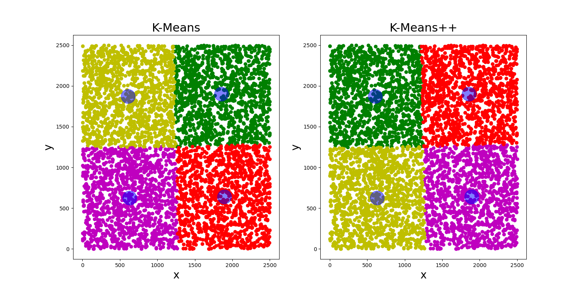

# K-Means and K-Means++
5000 samples, blue points are centroid of every cluster.

K = 3

K = 4

K = 5
  
  
# Usage
```
centroid, label, iter_num = k_means(data, k, seed=None)
centroid2, label2, iter_num2 = k_means_plus_plus(data, k, seed=None)
```
#### argument:
> * data:     
>   should be 2d array with shape (n_samples, n_features in every sample)
> * k:  
>   num of cluster  
> * max_iter:  
>   max iteration  
> * seed:  
>   numpy random seed, if you want to reproduce the result, please set a value  
  
#### return:  
> * centroid:  
>   ndarray. the centroid of every cluster, 2d array (n_cluster, n_features)   
> * label:    
>   ndarray. the cluster label to which every data sample belong    
> * iter_num:   
>   how many iteration to get the result    

# Speed
The K is set to 3, max_iter = 1.  

  
  
My code is faster than `scikit-learn 1.0` when the max_iter is set to the same.  
    
If you didn't set the value of max_iter (set to None), the iteration didn't stop 
until the element within every cluster no longer change.

When number of data is very huge such as billion, it may take some time to iterate data until the elements within every cluster no longer change.

So when data is very big, set the max_iter is a good choice.  


